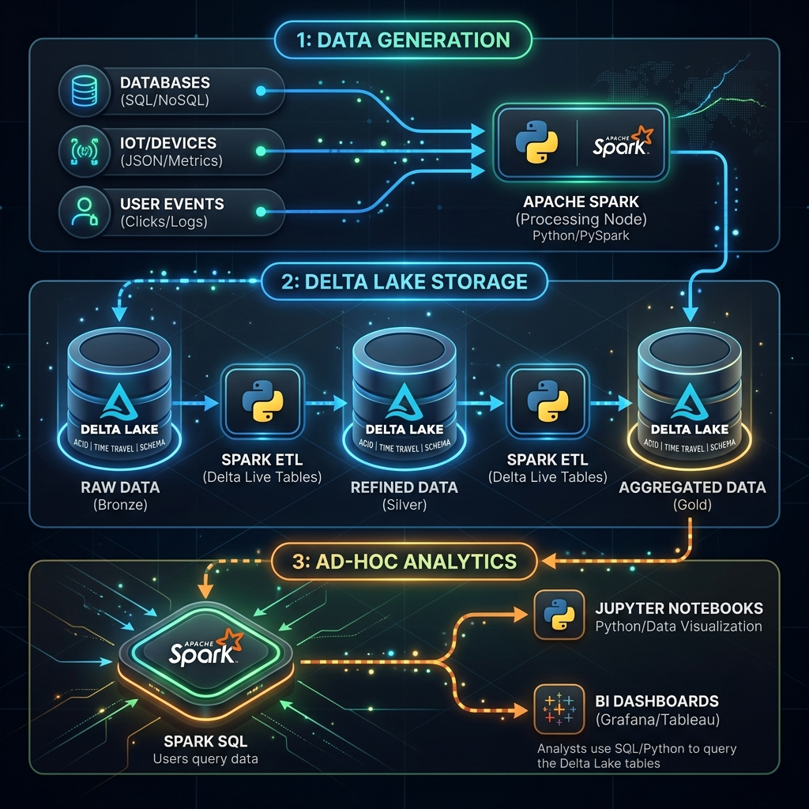

<div align="center">

  

  <h1>Scalper Bot Analytics & Flash Sale Cannibalization</h1>
  <p><em>A forensic data engineering investigation into how "Cyber Flash Drops" are silently destroying profit margins through deal-sniper users and coordinated bot exploitation.</em></p>

  <p>
    <a href="https://spark.apache.org/"></a>
    <a href="https://databricks.com/"></a>
    <a href="https://delta.io/"></a>
    <a href="https://python.org/"></a>
    <a href="https://pyspark.apache.org/"></a>
  </p>

  <p>
    
    
    
    
    
  </p>

</div>

---

## 🎯 Executive Summary

**VoltEdge Electronics** is a premium consumer electronics retailer known for its high-demand product launches. The company runs periodic **"Cyber Flash Drops"** — time-limited sales events offering steep discounts on next-gen gaming consoles, GPUs, and flagship peripherals.

While internal dashboards celebrate these events as traffic and revenue wins, this investigation reveals a different reality:

| Metric | What Dashboards Show | What This Analysis Reveals |
| :--- | :---: | :---: |
| Active Users | 📈 Spike | Inflated by bot-controlled burner accounts |
| Transaction Volume | 📈 Spike | Dominated by single-use "deal snipers" |
| Revenue | 📈 Spike | Masking **negative margins** on discounted SKUs |
| Customer Retention | Not tracked per cohort | Flash-acquired users **never return** |

> [!WARNING]
> **The core finding:** Flash sale-acquired customers are not an acquisition win — they are a margin hemorrhage. When combined with coordinated bot traffic, VoltEdge is effectively paying scalpers to deplete its own inventory.

---

## 🔍 The Investigation

### Hypothesis 1: Flash Sale Cannibalization
Users whose **first purchase** occurs during a Cyber Flash Drop have a deeply negative lifetime value (LTV). They buy once at a loss to the company and never return — classic **"deal sniper"** behavior.

### Hypothesis 2: Bot Exploitation Networks
A small cluster of IP addresses generates abnormally high transaction velocity during flash sale windows. These IPs correlate with:
- 🕐 **Account ages under 2 days** (freshly created burner accounts)
- 💳 **Prepaid credit cards** (untraceable payment methods)
- 🚀 **Overnight shipping** (secure inventory before detection)
- 👤 **Multiple user IDs per IP** (bypassing per-customer limits)

---

## 🏗 System Architecture

<div align="center">
  
  <br/>
  <em>End-to-end pipeline: Distributed data synthesis → Delta Lake storage → Forensic Spark SQL analytics</em>
</div>

---

## ⚙️ Why Databricks?

This is not a project that can run on a laptop with Pandas. Here is why Databricks was chosen as the execution environment:

<table>
  <tr>
    <th>Capability</th>
    <th>Justification</th>
    <th>Impact</th>
  </tr>
  <tr>
    <td><strong>🔥 Distributed Compute</strong></td>
    <td>Generates and processes 6.5M synthetic rows via <code>spark.range()</code> — fully parallelized across worker nodes.</td>
    <td>Seconds, not hours</td>
  </tr>
  <tr>
    <td><strong>🏛️ Delta Lake (ACID)</strong></td>
    <td>Guarantees transactional integrity during overwrites. Supports time-travel for reproducible ad-hoc queries.</td>
    <td>Reliable analytics</td>
  </tr>
  <tr>
    <td><strong>🪟 Advanced Windowing</strong></td>
    <td>60-second rolling <code>rangeBetween</code> windows partitioned by IP address across millions of rows — impossible to do efficiently in Pandas.</td>
    <td>Real-time velocity detection</td>
  </tr>
  <tr>
    <td><strong>🚫 No UDFs</strong></td>
    <td>All transformations use native Spark functions to avoid Python serialization overhead. Zero <code>@udf</code> decorators in the entire codebase.</td>
    <td>Maximum throughput</td>
  </tr>
</table>

---

## 📊 Data Schema

The synthetic dataset simulates 90 days of VoltEdge transaction history with deliberate anomaly injection.

| Column | Type | Description | Anomaly Role |
| :--- | :---: | :--- | :---: |
| `transaction_id` | `String` | Unique UUID per purchase | — |
| `transaction_timestamp` | `Timestamp` | Purchase date/time | Velocity detection |
| `user_id` | `Integer` | Customer identifier (1.5M unique) | Multi-account detection |
| `product_id` | `Integer` | Item identifier (50K unique) | — |
| `product_category` | `String` | Gaming Consoles · GPUs · Peripherals · Smartphones | Category-level margin analysis |
| `base_price` | `Double` | Retail price ($10–$1,010) | — |
| `discount_rate` | `Double` | Flash: 40–80% · Normal: 0–10% | Margin erosion signal |
| `final_price` | `Double` | `base_price × (1 - discount_rate)` | — |
| `margin_usd` | `Double` | `final_price - (base_price × 0.6)` | **Key metric** — negative = loss |
| `is_flash_sale` | `Boolean` | True for Cyber Flash Drop transactions | Primary filter |
| `ip_address` | `String` | Simulated IPv4 — bots use `192.168.1.x` pool | Bot clustering |
| `account_age_days` | `Integer` | Bots: 0–2 days · Normal: 0–365 days | Freshness signal |
| `payment_method` | `String` | Bots: Prepaid Credit Card · Normal: Credit Card / Digital Wallet | Payment fingerprint |
| `shipping_speed` | `String` | Bots: Overnight · Normal: Standard / Expedited | Urgency signal |

---

## 🚀 Quick Start Guide

### Prerequisites

| Requirement | Details |
| :--- | :--- |
| **Databricks Workspace** | Community Edition or higher |
| **Cluster Runtime** | DBR 10.4 LTS+ recommended |
| **DBFS Permissions** | Write access to `/tmp/` |

### Phase 1: Synthetic Data Generation

> Generates 6.5M enriched e-commerce records with embedded bot behavior patterns.

<details>
<summary><strong>📋 Step-by-step instructions</strong></summary>
<br/>

1. Open your Databricks Workspace and create a **new Python notebook**.
2. Copy the contents of [`scripts/data_generation.py`](scripts/data_generation.py) into the first cell.
3. Uncomment the last line: `df = generate_ecommerce_data(spark)`
4. Attach the notebook to your cluster and **Run All**.
5. **Output:** A Delta table with 6.5M records is persisted at:
   ```
   dbfs:/tmp/ecommerce_transactions_delta
   ```

</details>

### Phase 2: Forensic Analysis

> Executes two parallel investigations: cohort margin analysis and bot network detection.

<details>
<summary><strong>📋 Step-by-step instructions</strong></summary>
<br/>

1. Create a **second notebook** in your workspace.
2. Copy the contents of [`scripts/ad_hoc_analysis.py`](scripts/ad_hoc_analysis.py).
3. Run the notebook to execute:

| Analysis | Method | Output |
| :--- | :--- | :--- |
| **Cohort LTV** | `ROW_NUMBER()` window → acquisition tagging → lifetime margin aggregation by cohort + product category | Margin comparison table |
| **Bot Detection** | 60s `rangeBetween` window → velocity filtering (>5 txns/min) → IP-level aggregation with account age, payment, and shipping correlation | Anomalous IP report |

</details>

---

## 📂 Repository Structure

```
ecommerce-flash-sale-analysis/
│
├── 📁 docs/
│   ├── architecture.png          # Pipeline diagram (high-quality PNG)
│   ├── architecture.svg          # Pipeline diagram (scalable vector)
│   └── data_lineage.md           # Full data lineage & transformation docs
│
├── 📁 scripts/
│   ├── data_generation.py        # PySpark distributed data synthesizer
│   └── ad_hoc_analysis.py        # Forensic cohort & bot analytics
│
├── .gitignore                    # Python / Spark / Delta exclusions
├── LICENSE                       # MIT License
└── README.md                     # This file
```

---

## 🔗 Further Reading

- [Data Lineage Documentation](docs/data_lineage.md) — Full schema, transformation logic, and data dictionary.
- [Architecture Diagram (SVG)](docs/architecture.svg) — Scalable vector version of the pipeline diagram.

---

## 👩‍💻 Author

<table>
  <tr>
    <td><strong>Sohila Khaled</strong></td>
  </tr>
  <tr>
    <td><em>BI Developer</em></td>
  </tr>
</table>

---

## 📄 License

This project is licensed under the **MIT License** — see the [LICENSE](LICENSE) file for details.
